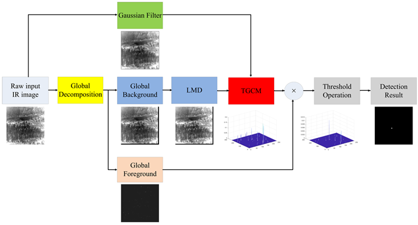
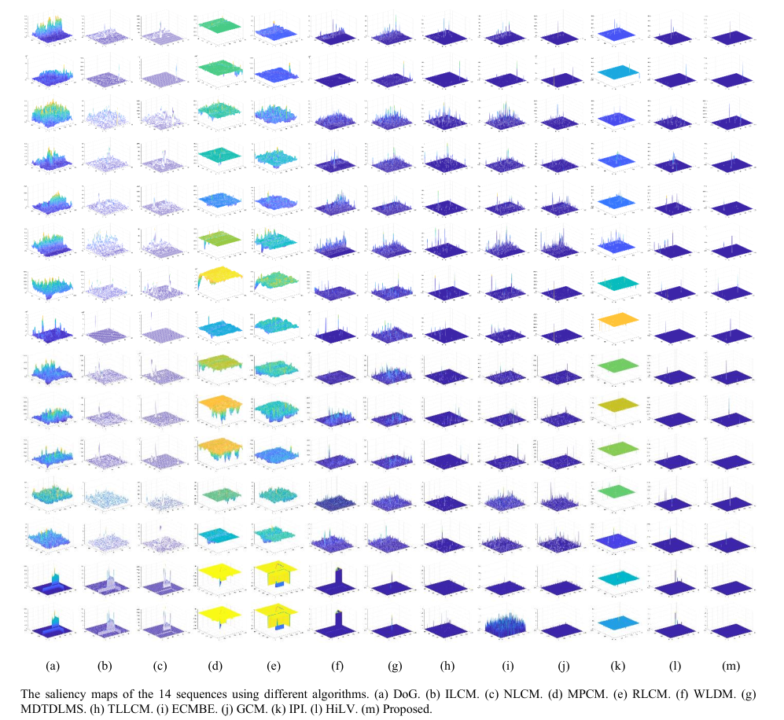
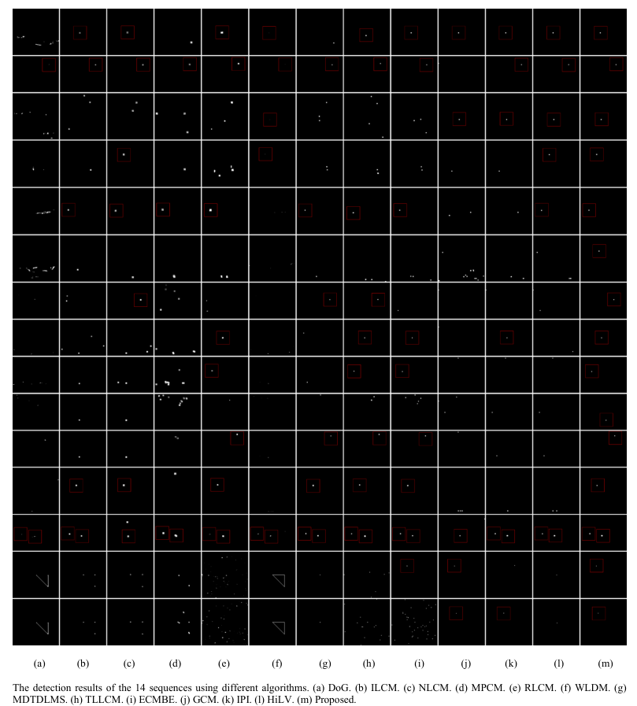
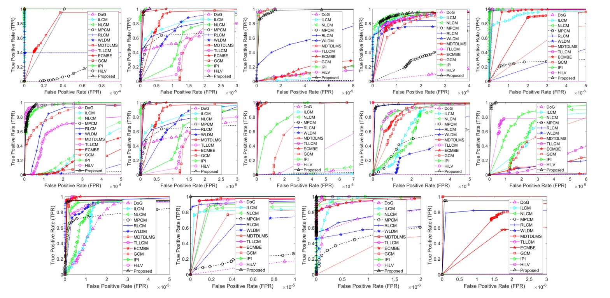

# A True Global Contrast Method for IR Small Target Detection under Complex Background

This repository contains the source code for the paper:

> **Jinhui Han, Saed Moradi, Bo Zhou, Wei Wang, Qian Zhao, and Zhen Luo**,  
> *"A True Global Contrast Method for IR Small Target Detection under Complex Background,"*  
> IEEE Transactions on Geoscience and Remote Sensing (TGRS), vol. XX, pp. XX–XX, 2025.

---

## Overview

This code implements the **True Global Contrast Measure (TGCM)** method for infrared (IR) small target detection under complex background conditions, as proposed in the above paper.  
TGCM leverages global decomposition combined with local contrast operations to enhance true targets while suppressing complex backgrounds and noise.

### TGCM Processing Pipeline




---

## Getting Started

### Prerequisites

- MATLAB **R2020b** (tested version)
- Basic MATLAB toolboxes (no additional libraries required)

### Running the Code

1. Clone or download this repository.
2. Place your test images in the `./data/` folder.
3. Open MATLAB and navigate to the project folder.
4. Run the main script:

```matlab
SHOW_TGCM
```

You will see the step-by-step processing results of the TGCM algorithm, and the results will be stored in the `./results/` folder.

---

## Folder Structure

```
.
├── data/              # Folder containing test IR image samples
├── results/           # Folder to save detection results, saliency maps, processed images
├── SHOW_TGCM.m        # Main demo script to run the algorithm
├── Other .m files     # Supporting functions used in the algorithm
└── README.md          # This file
```

---

## Results

Below are **example results** of the TGCM algorithm compared to several baseline methods, as reported in the paper.


### Example Comparison of Methods (Saliency Maps)



### Final Detection Results Across Sequences



### ROC Curves



### Key Observations:

✅ TGCM effectively enhances true small targets.  
✅ It suppresses complex backgrounds and high-brightness edges.  
✅ Robust to **non-locally prominent targets** (where local contrast methods fail).  
✅ Outperforms recent local and global baseline methods on both real and simulated IR sequences.  

---

## Citing

If you use this code in your research, please cite the following papers:

```bibtex
@article{han2025tgcm,
  title     = {A True Global Contrast Method for IR Small Target Detection under Complex Background},
  author    = {Han, Jinhui and Moradi, Saed and Zhou, Bo and Wang, Wei and Zhao, Qian and Luo, Zhen},
  journal   = {IEEE Transactions on Geoscience and Remote Sensing},
  volume    = {XX},
  pages     = {XX--XX},
  year      = {2025}
}

@article{gao2013ipi,
  title     = {Infrared Patch-Image Model for Small Target Detection in a Single Image},
  author    = {Gao, Chen and Meng, Deyu and Yang, Yi and Wang, Yuhan and Zhou, Xiaoqiang and Hauptmann, Alexander G.},
  journal   = {IEEE Transactions on Image Processing},
  volume    = {22},
  number    = {12},
  pages     = {4996--5009},
  year      = {2013},
  doi       = {10.1109/TIP.2013.2281420}
}
```

---

## Dataset Acknowledgment

The image data used in this code is acquired from:

- B. Hui, Z. Song, H. Fan, P. Zhong, W. Hu, X. Zhang, J. Ling, H. Su, W. Jin, Y. Zhang, and Y. Bai,  
  *"A dataset for infrared detection and tracking of dim-small aircraft targets under ground / air background,"*  
  China Scientific Data, vol. 5, no. 3, 2020.  
  [doi: 10.11922/sciencedb.902](https://doi.org/10.11922/sciencedb.902)

---

